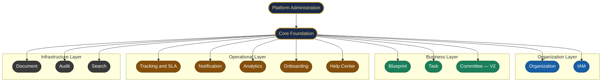
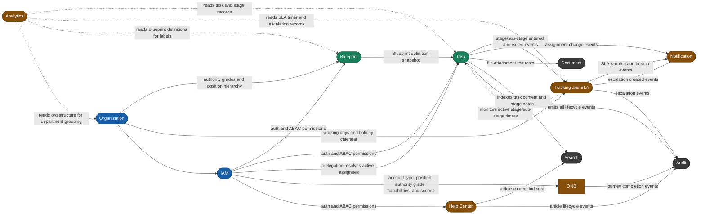
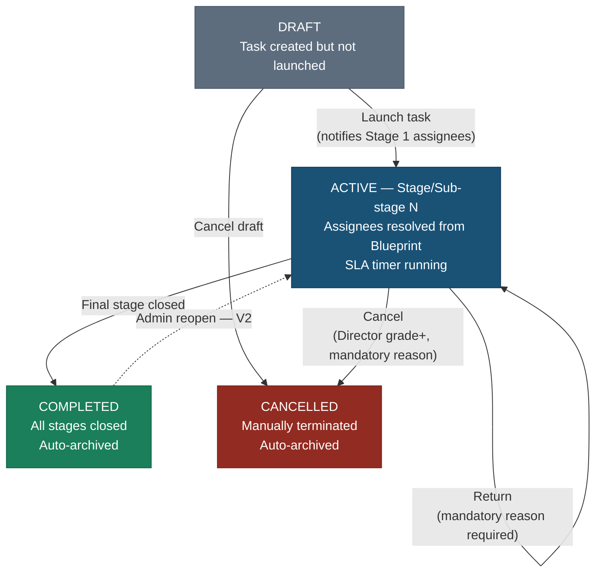
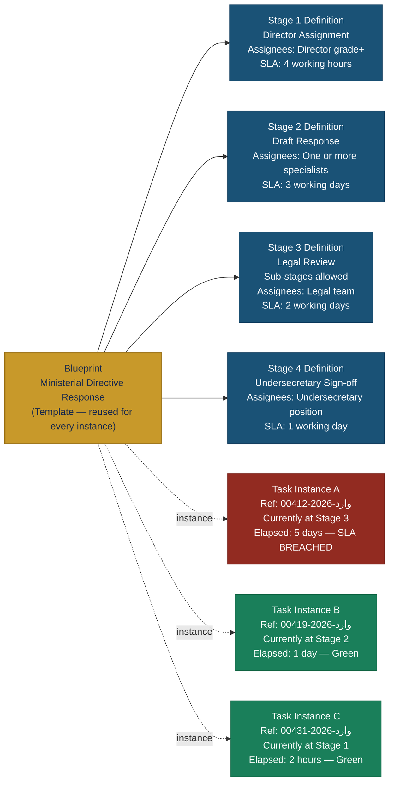
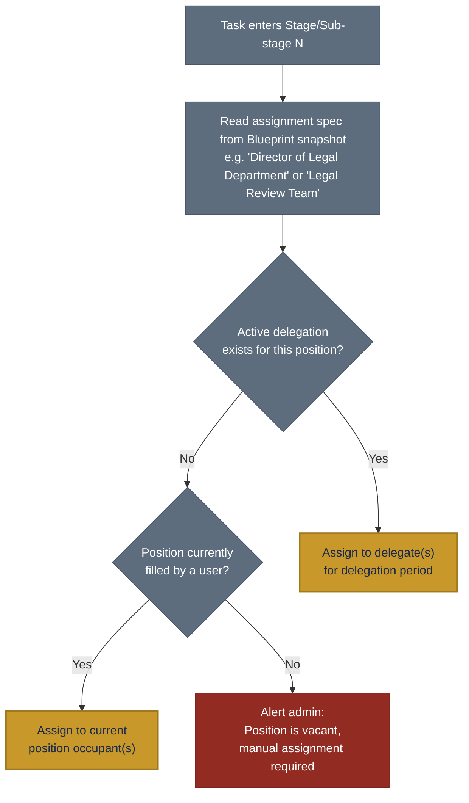

# Module Boundary Map

## Configurable Task Lifecycle Management Platform

> **Phase:** System Design — Module Boundaries
>
> **Input:** Feature Inventory v1 (273 features, 21 domains)
>
> **Next:** Visibility & Access Rules Session → ERD

---

## Module Catalog

| Module | Layer | Phase | Primary Responsibility |
| --- | --- | --- | --- |
| **Core** | Foundation | **MVP** | Multi-tenant context, event bus, base models, date and locale utilities, shared traits, soft-delete infrastructure |
| **Platform** | Foundation | **MVP** | Central DB management, tenant provisioning, tenant suspension, platform admin management, impersonation sessions |
| **Organization** | Organization | **MVP** | Org entities, department hierarchy, positions, reporting lines, authority grades, working calendar, public holiday configuration |
| **IAM** | Organization | **MVP** | Users, authentication, delegation, out-of-office status, ABAC policy engine |
| **Blueprint** | Business | **MVP** | Blueprint templates, stage and sub-stage definitions, transition rules, SLA policies per stage/sub-stage, Blueprint library, versioning (V2) |
| **Task** | Business | **MVP** | Task instances, stage/sub-stage lifecycle progression, assignment resolution, external references, comments, sub-tasks (V2), recurring tasks (V2) |
| **Tracking & SLA** | Operational | **MVP** | Stage/sub-stage-level SLA timers, holiday-aware deadline calculation, overdue detection, escalation engine |
| **Notification** | Operational | **MVP** | In-app alerts, email notifications, notification template management, SMS (V2), WhatsApp (V2), user preferences (V2) |
| **Analytics** | Operational | **MVP** | Executive dashboard, director dashboard, bottleneck analysis, task aging report, stage SLA reports, personal workspace views |
| **Onboarding** | Operational | **MVP** | Access-profile-based guided journeys, interactive walkthroughs, knowledge checks, training progress tracking, admin training dashboard |
| **Document** | Infrastructure | **MVP** | File attachments, version history, inline preview, access restriction (V2) |
| **Audit** | Infrastructure | **MVP** | Immutable event log, per-item audit trail, user activity reports, log export (V2) |
| **Search** | Infrastructure | **MVP** | Full-text indexing across tasks, stages, and sub-stages, external reference lookup, Hijri date search, saved searches (V2) |
| **Help Center** | Operational | **MVP** | Article library, bilingual content management, article categories, article search, contextual help links (V2) |
| **Committee** | Business | **V2** | Committees, meetings, minutes, decisions, action items, voting (V3) |

---

## Diagram 1 — Module Layer Architecture

---

## Diagram 2 — Module Communication (Key Data Flows)

Solid `-->` = data written or action triggered.
Dotted `-.-` = read-only query, no mutation.

---

## Diagram 3 — Task Stage State Machine

A single task instance moves through these states. This is what the Task module owns.

---

## Diagram 4 — Blueprint-to-Task Relationship

How a single Blueprint template generates multiple independent task instances.

---

## Diagram 5 — Stage/Sub-stage Assignment Resolution

How the system determines who is assigned to a stage or sub-stage at runtime —
the key mechanism that makes org changes automatically reflected.

---

## Feature-to-Module Mapping

| Feature Domain (from Feature Inventory v3) | Module |
| --- | --- |
| Organization & Structure Management | Organization |
| Working Calendar & Public Holiday Configuration | Organization |
| User & Profile Management | IAM |
| Delegation & Out-of-Office | IAM |
| Blueprint Management — Definition and Library | Blueprint |
| Blueprint Management — Stage and Sub-stage Definitions | Blueprint |
| Blueprint Management — Transition Rules | Blueprint |
| Blueprint Management — Versioning (V2) | Blueprint |
| Task Management — Creation and Lifecycle | Task |
| Task Management — External Reference Linking | Task |
| Stage Lifecycle Management | Task |
| Comments & Collaboration | Task |
| Recurring Tasks (V2) | Task |
| Follow-Up & Tracking | Tracking & SLA |
| SLA Engine — Stage/Sub-stage Timers | Tracking & SLA |
| SLA Engine — Holiday-Aware Calculation | Tracking & SLA |
| Escalation Engine | Tracking & SLA |
| Notifications & Alerts | Notification |
| Analytics & Dashboards | Analytics |
| Personal Workspace (cross-module views) | Analytics |
| User Onboarding & Training (Domain 21) | Onboarding |
| Document & Attachment Management | Document |
| Archive & Records Management | Audit + Document |
| Audit Trail | Audit |
| Search & Discovery | Search |
| Documentation / Help Center | Help Center |
| Committee Management (V2) | Committee |
| Multi-Language & Localization | Core |
| System Administration | Core + all modules |

---

## Module Boundary Rules

**Rule 1 — No direct database joins across module boundaries.**
Each module queries only its own tables. Cross-module data is accessed through
internal service method calls or read models derived from events. No module
imports another module's ORM models.

**Rule 2 — Blueprint governs Task; Task does not modify Blueprint.**
The Blueprint module provides the lifecycle definition. When a task is created, the Task
module stores a snapshot of the relevant Blueprint version. Even if the Blueprint is later
updated or versioned, the task follows the rules of its snapshot. A task never writes back
to Blueprint tables.

**Rule 3 — Stage/sub-stage assignment is resolved at runtime through service calls, never cached statically.**
When a task enters a stage or sub-stage, the Task module calls the Organization and IAM modules to
resolve the current person or people matching the assignment specification. If a delegation is active,
IAM provides the delegate. If a required position is vacant, the system raises an alert.
This means org structure changes and delegations are reflected immediately in new stages and sub-stages.

**Rule 4 — Tracking & SLA monitors; it does not own task data.**
The SLA engine owns only SLA timer records and escalation records. It observes stage
and sub-stage entry and exit events emitted by the Task module. It fires breach and warning events
to the Notification module. It never writes to task tables.

**Rule 5 — Analytics is always read-only.**
Analytics never writes to any domain table. It reads from dedicated read models or query
views. The entire Analytics module can be rebuilt from scratch without touching any
business or operational data.

**Rule 6 — Audit receives events; it never queries back.**
All modules emit domain events to the Audit module. Audit stores them immutably and
acknowledges receipt. No other module reads from Audit tables at runtime. Audit data
is accessed only by humans performing compliance reviews, through the admin UI.

**Rule 7 — IAM is consulted, not embedded.**
No module duplicates permission logic. Every access check calls the IAM module's ABAC
policy engine. Permission rules live in exactly one place.

**Rule 8 — Core owns nothing domain-specific.**
Core provides tenant resolution, event bus infrastructure, base model traits
(soft delete, timestamps, audit hooks), dual-date utilities, and localization helpers.
It has no knowledge of what a Blueprint, Task, or Stage is. No business logic lives in Core.

**Rule 9 — Onboarding reads access profile; it does not assign permissions.**
The Onboarding module calls IAM to determine the user's account type, current position, authority grade, capabilities, monitoring scopes, and task-participation pattern. It selects the correct journey based on that access profile. It never writes to IAM tables, modifies positions, or grants capabilities. Journey progress and quiz scores are stored in Onboarding's own tables only.

**Rule 10 — Help Center is self-contained content management.**
The Help Center module manages its own articles, categories, and content. It calls IAM for access decisions (who can create, edit, and delete articles). It emits article lifecycle events to Audit. Article content is indexed by the Search module. It does not read from or write to any business module (Blueprint, Task, Tracking). It has no knowledge of tasks, stages, or workflows.

**Rule 11 — Platform Administration is external to tenants.**
The Platform module interacts only with the Central Management Database. It provisions tenants, manages subscriptions, and logs impersonation initiations. It never queries tenant databases directly except via an active, authenticated impersonation session context.

---

## Shared Concerns (Cross-Cutting, Not Module-Owned)

| Concern | How Handled |
| --- | --- |
| **Multi-tenancy** | Core resolves tenant context from every request. All module queries inherit tenant scope transparently. No module manages tenant isolation itself. |
| **Localization (Arabic/English)** | Core provides locale helpers and RTL/LTR context. All modules use them for labels, dates, notifications, and document generation. |
| **Hijri Calendar** | Core provides dual-date conversion utilities. Organization provides working-day and holiday rules. Tracking & SLA uses both for every deadline calculation. |
| **Policy-Based ABAC Permissions** | IAM owns the policy engine, capability grants, scoped grants, and policy rules store. All modules call IAM for access decisions. No module embeds its own permission checks. |
| **Soft Deletes** | Applied at base model level in Core. Every module inherits it. Nothing in any business or operational table is hard-deleted. |
| **Audit Logging** | An event listener in the Audit module captures events emitted by all other modules. Modules emit events and do not log directly. |

---

## What is NOT in Any Module at This Stage

Explicitly deferred or out of scope for the entire current design phase:

- Correspondence document management — external government system, not this platform
- G2G (Government-to-Government) secure messaging integration — V3
- Digital signature integration (UAE PASS, Nafath, Tasdeeq) — V3
- ERP / SAP / Oracle integration — V3
- Procurement workflow module — V3
- Security clearance and Need-to-Know classification domain — V3
- AI / predictive analytics engine — V3
- eID national identity provider integration — V3

---

*Document version: 1.0* 
*from Feature Inventory v1.2 (296 features, 23 domains)*
*Next: Visibility & Access Rules*
