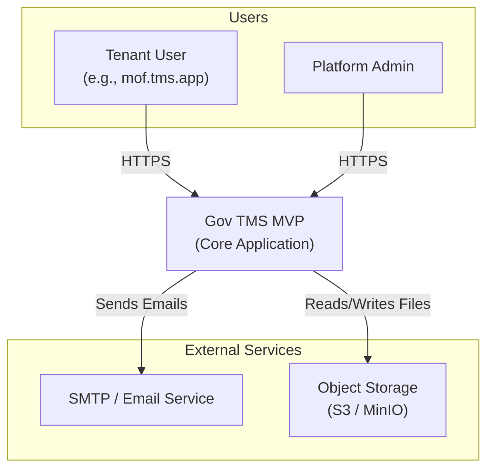
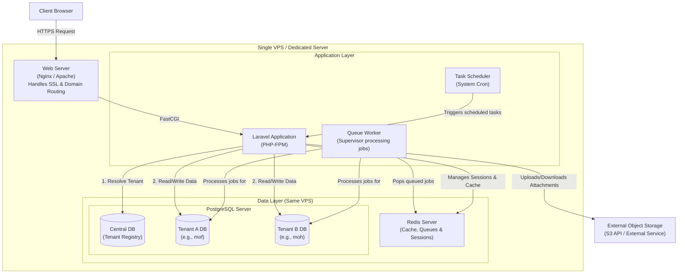
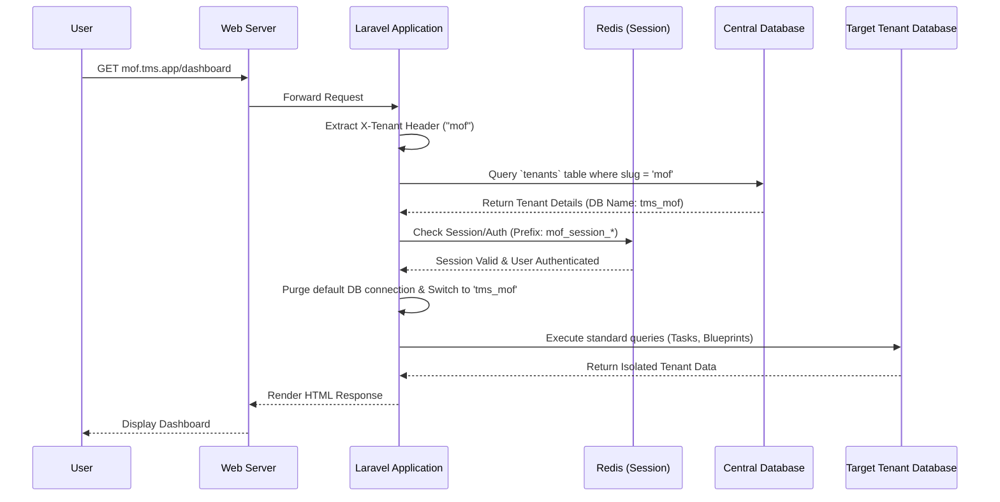

# MVP Architecture Diagrams

## Configurable Task Lifecycle Management Platform

>**Version:** 1.0  
>
>**Infrastructure Model:** Simple VPS Deployment (Monolithic Application)

---

## 1. System Context Diagram

This diagram provides a high-level overview of how users interact with the Gov TMS MVP and the external services the platform relies on.

---

## 2. Infrastructure Container Diagram (Single VPS)

This diagram breaks down the internal components running on the single VPS. It reflects the exact MVP deployment: no Kubernetes, no auto-scaling groups, and no complex load balancers. Everything runs within a single server boundary, utilizing shared services for cost efficiency while maintaining strict database-level data isolation.

### Component Breakdown
*   **Web Server (Nginx):** Terminates SSL and forwards requests to the PHP-FPM application.
*   **Application (Laravel / PHP-FPM):** The core monolithic backend handling HTTP requests, business logic, and database routing.
*   **Queue Worker (Supervisor):** A background PHP CLI process managed by Supervisor that listens to Redis queues to process heavy tasks (like sending emails or checking SLAs) asynchronously.
*   **PostgreSQL:** A single database server instance hosting the central management database and all isolated tenant databases.
*   **Redis:** A single Redis instance securely shared across tenants via key prefixing (namespacing).

---

## 3. Multi-Tenancy Request Flow (Sequence)

This sequence diagram illustrates how the Laravel application implements the Database-per-Tenant strategy on a single server, dynamically switching connections without cross-tenant data spillage.

### Flow Highlights
1.  **Stateless Routing:** The application does not hardcode tenant connections. It resolves the tenant database dynamically on every single HTTP request based on the `X-Tenant` header.
2.  **Shared Session Check:** It verifies authentication in the shared Redis cache using a strict tenant prefix so that a session token for Tenant A is invalid on Tenant B.
3.  **Strict Isolation:** Once the connection switches to the tenant database, all Eloquent ORM queries automatically target that specific database. No `WHERE tenant_id = ?` filters are needed in application code, eliminating the risk of cross-tenant data leaks.

---

*Document version: 1.0*  
*Next: API & Frontend Architecture Strategy*